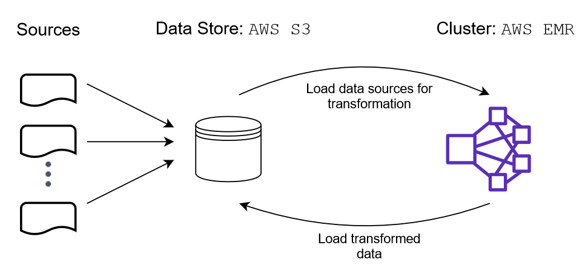
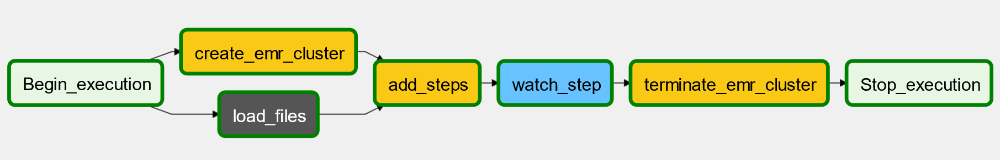

# Data Pipeline to Transform I94 Immigration Data with PySpark on AWS EMR

## Objective

The objective of this project is to combine the I94 immigration data with statistics of temperature of the country of origin and demographics of the state where the traveler visited. By enhancing the data with additional context, we can gain better insights into the incoming travelers to the US. The ultimate goal is to automate this process through an ETL pipeline orchestrated with **Airflow** and store the transformed data in an S3 bucket for easy access and analysis.

## Overview

The scope of this project is to improve the gathering and combination of information related to visitors to the US using the I94 immigration data as a starting point. The output of the pipeline is an analytical table that can be utilized by government agencies, marketing teams, and other businesses. This table contains information related to the country of origin of the visitors as well as details about the location where the visitor arrived in the US.

The main challenge with the I94 immigration data is that the information is stored in coded formats, such as codes for US states, occupations, and dates. This makes the data less explicit and accessible to various types of users. Additionally, the dataset lacks context information that we aim to add. Given the large amount of data, we leverage PySpark running on an Elastic MapReduce (EMR) cluster to perform the data transformations. Furthermore, this process is automated through Airflow to execute each task in a defined order.

## Implementation

### ETL

Since we are dealing with a large volume of data and need to transform it for further analysis, this pipeline is designed to run annually or semi-annually. The following steps explain the process:

##### Sources

We have four sources of data stored in an AWS S3 bucket:
- I94 Immigration Data: US National Tourism and Trade Office data of visitors. Source: [I-94 Record](https://travel.trade.gov/research/reports/i94/historical/2016.html)
- World Temperature Data: Information about temperature by city. Source: [Kaggle](https://www.kaggle.com/berkeleyearth/climate-change-earth-surface-temperature-data)
- U.S. City Demographic Data: Demographic statistics by state of the U.S. Source: [Opensoft](https://public.opendatasoft.com/explore/dataset/us-cities-demographics/export/)
- Airport Code Table: Airport codes and corresponding cities. Source: [DataHub](https://datahub.io/core/airport-codes#data)

##### Extraction

The data sources are loaded into an S3 bucket to enable access from the EMR cluster running PySpark.

##### Transformation

Once the data is loaded into PySpark dataframes, the following transformations are performed:

1. **Date columns cast type**: The columns with the arrival and departure dates from the immigration data are transformed from SAS date numeric fields to datetime format.

2. **Add demographic data**: Using the `i94addr` column from the immigration data, we join the demographic data. The demographic data is available at the city level, while the immigration data only has information at the state level. Therefore, the demographic data is aggregated to the state level for combining it with the immigration data.

3. **Add airport data**: As a preliminary step to join the temperature data, we map the city of origin using the airport code.

4. **Add temperature data**: With the city of origin, we can retrieve the temperature data by airport and arrival date.

##### Load

The resulting transformed dataframe is loaded into an S3 bucket for long-term storage.

A diagram of the process is shown below:

## Data Pipeline

The ETL pipeline is orchestrated by defining a directed acyclic graph (

DAG) on Airflow, which consists of the following nodes/tasks:

- `load_files`: A subdag that uploads files to S3. It includes the following tasks:
    - `load_transform_script`: Loads the `transform.py` script that performs the data transformation.
    - `load_quality_script`: Loads the `quality.py` script that checks the data quality of the transformed data.
    - `load_airport_data`: Loads the CSV file with information related to airports.
    - `load_temperature_data`: Loads the CSV file with information related to city temperatures.
    - `load_demographic_data`: Loads the CSV file with information related to US states' demographics.

- `create_emr_cluster`: Creates a cluster in AWS EMR.

- `add_steps`: Adds a procedure to submit the Python script to Spark.

- `watch_step`: Adds a listener to monitor the state of the procedure on the cluster.

- `terminate_emr_cluster`: Terminates the cluster in AWS EMR.

The DAG is shown below:

### Files

The project repository includes the following files:

- `docker-compose.yml`: Defines the Docker container for Airflow.
- `dags/transform_dag.py`: Specifies the DAG of the data pipeline.
- `dags/load_subdag.py`: Specifies the 'load_files_subdag', which is part of the 'transform' DAG.
- `plugins/operators/move.py`: Defines an operator to load data to S3.
- `plugins/operators/quality.py`: Defines an operator to check data quality.
- `plugins/helpers/configurations.py`: Stores configuration and steps to add for starting the EMR cluster.
- `airflow/plugins/operators/data_quality.py`: Defines an operator to check data quality.
- `dags/data`: Directory that contains the data to upload to S3.
- `dags/scripts`: Directory that contains scripts to upload to S3 and run on EMR.
- `explore.ipynb`: Jupyter Notebook that contains examples of queries with the transformed data.
- `data_dictionary.xlsx`: Excel file with metadata of the table with the transformed data.

## Instructions

Follow the instructions below to run the data pipeline:

1. Download the data from [Google Drive](https://drive.google.com/drive/folders/1bM4lJhssSqo8DGhv3cVBBbkWYhIvv-JO?usp=sharing) and store it in the `dags/data` directory.

2. Upload the I94 Immigration data to the S3 bucket.

3. Set the name of the S3 bucket in the `dags/transform_dag.py` file.

4. Add your *AWS Access Key* and *AWS Secret Key* to the `dags/scripts/transform.py` file.

5. Run `docker-compose up` in the terminal from the project's working directory.

6. Open a web browser and go to `localhost:8080` to access Airflow.

7. Unpause the *transform* DAG.

8. Once the DAG has completed, you can run query examples in the `explore.ipynb` notebook.

## Discussion

Here are some considerations for scaling the data pipeline:

**Data increases by 100x**: The pipeline is designed to handle large volumes of data within 10 minutes. If the data increases by 100x, the EMR cluster configuration can be adjusted to increase the memory and resources to accommodate the higher data volume.

**Pipeline must run on a daily basis by 7am**: The current pipeline is designed to run yearly. To change it to a daily basis by 7am, the DAG configuration should be modified. The `schedule_interval` should be set to `@daily`, and the

 `start_date` should be adjusted to an hour before 7am.

**Database needed to be accessed by 100+ people**: The transformed data is stored in an S3 bucket, which can be accessed by any number of people without any issues.

## References

- [Solving 5 Mysterious Spark Errors](https://medium.com/@yhoso/resolving-weird-spark-errors-f34324943e1c#ca65#3604)

- [How to submit Spark jobs to EMR cluster from Airflow](https://www.startdataengineering.com/post/how-to-submit-spark-jobs-to-emr-cluster-from-airflow/)
